  

  <a href="https://github.com/stophemo/digital-brain"><strong>KNOWLEDGE</strong></a>
  &nbsp;&nbsp;·&nbsp;&nbsp;
  <a href="https://github.com/stophemo/Woo"><strong>CAPTURE</strong></a>
  &nbsp;&nbsp;·&nbsp;&nbsp;
  <a href="https://github.com/stophemo/woo-todo"><strong>ACTION</strong></a>
  &nbsp;&nbsp;·&nbsp;&nbsp;
  <a href="https://github.com/stophemo?tab=repositories">ALL BUILDS ↗</a>

> **I build with AI to turn scattered information into durable knowledge — and intent into action.** 
> 我用 AI 构建会持续生长的系统：让信息沉淀为知识，让想法自然抵达行动。

## `// SELECTED SYSTEMS`

  

  

  

## `// OPERATING MODE`

`SYSTEMS > ONE-OFFS` &nbsp;·&nbsp; `CLARITY > CLEVERNESS` &nbsp;·&nbsp; `CALM IS A FEATURE`

我喜欢把零散功能组织成可持续演化的系统，也相信真正好的工具，应该降低注意力成本，而不是制造更多噪音。

## `// TOOLCHAIN`

**Systems** — AI Agents · LLM Workflows · Knowledge Architecture 
**Building** — TypeScript · Vue · Rust · Swift · Kotlin · Java · Python 
**Medium** — Markdown · Git / GitHub · Obsidian · Plain Files

## `// CONNECT`

  <a href="https://github.com/stophemo">GitHub</a>
  &nbsp;&nbsp;·&nbsp;&nbsp;
  <a href="https://github.com/stophemo?tab=repositories">Repositories</a>

  Building quiet software with a visible pulse.

