<a href="https://github.com/stophemo?tab=repositories">
  <picture>
    <source media="(max-width: 767px)" srcset="./assets/field-log-mobile.svg" />
    
  </picture>
</a>

  <code>exploring the world</code> · 探索世界

### Selected signals

`01` **[Woo](https://github.com/stophemo/Woo)** 
`02` **[woo-todo](https://github.com/stophemo/woo-todo)** 
`03` **[digital-brain](https://github.com/stophemo/digital-brain)**

  build systems · follow curiosity · route still unfolding

