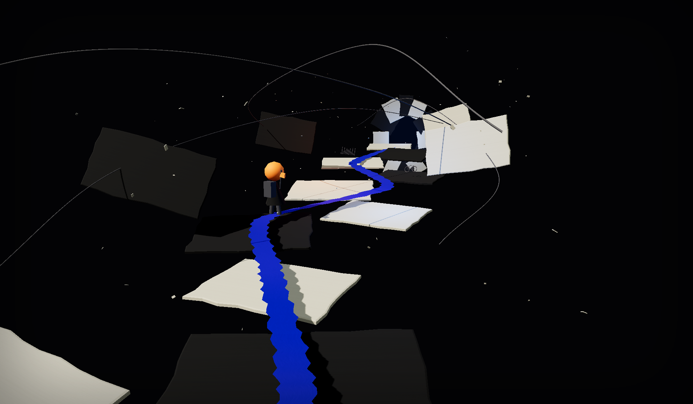

<picture>
  <source media="(max-width: 767px)" srcset="./assets/profile-spatial-mobile.png" />
  
</picture>

  things found along the way: 
  <a href="https://github.com/stophemo/Woo">Woo</a> ·
  <a href="https://github.com/stophemo/woo-todo">woo-todo</a> ·
  <a href="https://github.com/stophemo/digital-brain">digital-brain</a>

