<picture>
  <source media="(max-width: 767px)" srcset="./assets/hero-v3-mobile.svg" />
  
</picture>

<p align="center">
  <strong>Mostly code. Sometimes useful. Always for fun.</strong><br />
  多数是代码，偶尔有用，好玩最重要。
</p>

## me.js

```js
const me = {
  likes: ["写代码", "小工具", "奇怪点子"],
  now: "想到什么好玩就做什么",
  rule: "有用很好，好玩更重要",
};
```

## Some things that escaped localhost

- [Digital Brain](https://github.com/stophemo/digital-brain) — 整理个人知识时，顺手搭起来的一套方法。
- [Woo](https://github.com/stophemo/Woo) — 一个离线也能用的 Markdown 笔记小工具。
- [Woo Todo](https://github.com/stophemo/woo-todo) — 给 macOS 和 Android 写的简单待办。

## Toolbox

TypeScript · Vue · Rust · Swift · Kotlin · Java · Python

## Say hi

[GitHub](https://github.com/stophemo) · [Repositories](https://github.com/stophemo?tab=repositories)

<p align="center">
  <sub>Thanks for stopping by. Go make something fun.</sub>
</p>
