<picture>
  <source media="(max-width: 767px)" srcset="./assets/explore-world-mobile.svg" />
  
</picture>

  
    <a href="https://github.com/stophemo/Woo">Woo</a> ·
    <a href="https://github.com/stophemo/woo-todo">woo-todo</a> ·
    <a href="https://github.com/stophemo/digital-brain">digital-brain</a>
  

