<picture>
  <source media="(max-width: 767px)" srcset="./assets/atlas-hero-mobile.svg" />
  
</picture>

## Current coordinates / 当前坐标

<table>
  <tr>
    <td width="33%" valign="top">
      01 / NOTES 
      <strong><a href="https://github.com/stophemo/Woo">Woo</a></strong>  
      跨平台、本地优先的 Markdown 笔记应用，把编辑、版本、同步与 AI 辅助放在同一处。  
      <a href="https://woo-notes.vercel.app">产品主页</a> · <a href="https://github.com/stophemo/Woo/releases/latest">下载</a>
    </td>
    <td width="33%" valign="top">
      02 / ACTION 
      <strong><a href="https://github.com/stophemo/woo-todo">woo-todo</a></strong>  
      为“今晚规划，明早开干”设计的轻量待办：macOS 透明悬浮，Android 桌面 Widget，默认离线。  
      <a href="https://woo-todo.vercel.app">产品主页</a> · <a href="https://github.com/stophemo/woo-todo/releases/latest">下载</a>
    </td>
    <td width="34%" valign="top">
      03 / MEMORY 
      <strong><a href="https://github.com/stophemo/digital-brain">digital-brain</a></strong>  
      用 Codex 或 Claude Code 初始化一座本地、可迁移的 Markdown 知识库；拒绝覆盖，也不替你上传。  
      <a href="https://github.com/stophemo/digital-brain#readme">开始搭建</a>
    </td>
  </tr>
</table>

<picture>
  <source media="(max-width: 767px)" srcset="./assets/atlas-trace-mobile.svg" />
  
</picture>

轨迹按周聚合，数字由 GitHub Actions 每日更新。

Still exploring, one useful thing at a time. / 仍在探索，一次做成一件有用的事。

