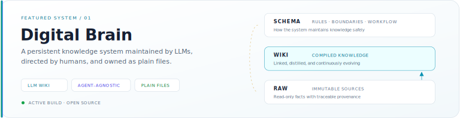

  <picture>
    <source media="(prefers-color-scheme: dark)" srcset="./assets/hero-dark.svg" />
    <source media="(prefers-color-scheme: light)" srcset="./assets/hero-light.svg" />
    
  </picture>

  <a href="https://github.com/stophemo/digital-brain">Digital Brain</a>
  &nbsp;·&nbsp;
  <a href="https://github.com/stophemo/Woo">Woo</a>
  &nbsp;·&nbsp;
  <a href="https://github.com/stophemo/woo-todo">Woo Todo</a>
  &nbsp;·&nbsp;
  <a href="https://github.com/stophemo?tab=repositories">All Builds</a>

## `// ABOUT`

**I build with AI to turn information into durable knowledge—and intent into action.**

我用 AI 构建系统，让信息沉淀为长期知识，让意图落实为行动。我关注 AI Agent、个人知识系统，以及那些足够安静、不与人争夺注意力的效率工具。

## `// CURRENT SIGNAL`

| 信号 | 此刻 |
| :-- | :-- |
| `BUILDING` | [Digital Brain](https://github.com/stophemo/digital-brain)：让 LLM 持续维护、让知识长期复利的个人 wiki |
| `CRAFTING` | [Woo](https://github.com/stophemo/Woo) 与 [Woo Todo](https://github.com/stophemo/woo-todo)：更克制的记录与行动体验 |
| `EXPLORING` | Agent memory、知识架构，以及人与 AI 的长期协作方式 |

## `// FEATURED SYSTEM`

<a href="https://github.com/stophemo/digital-brain">
  <picture>
    <source media="(prefers-color-scheme: dark)" srcset="./assets/digital-brain-dark.svg" />
    <source media="(prefers-color-scheme: light)" srcset="./assets/digital-brain-light.svg" />
    
  </picture>
</a>

一个由 LLM 持续维护、与具体 Agent 无关，并让知识长期复利的个人 wiki。

- `Schema` 定义规则、边界与维护纪律；
- `Wiki` 承载经过提炼、互相链接的长期知识；
- `Raw` 保存只读、不可变、可追溯的事实来源；
- 方法不绑定 Claude、Codex 或任何单一工具。

[Explore Digital Brain →](https://github.com/stophemo/digital-brain)

## `// MORE BUILDS`

### 02 / [Woo](https://github.com/stophemo/Woo)

一个克制、专注，帮助用户减少干扰并记录想法的笔记应用。 
`Vue` · `Notes` · `Calm UX` · [View repository →](https://github.com/stophemo/Woo)

### 03 / [Woo Todo](https://github.com/stophemo/woo-todo)

一个面向 macOS 与 Android 的透明化跨端待办应用。 
`TypeScript` · `macOS` · `Android` · [View repository →](https://github.com/stophemo/woo-todo)

## `// OPERATING PRINCIPLES`

**01 · SYSTEMS OVER ONE-OFFS** 
将零散功能组织成能够持续演化、不断积累价值的系统。

**02 · CLARITY OVER CLEVERNESS** 
先保证清晰、可理解与可维护，再谈聪明的技巧。

**03 · CALM IS A FEATURE** 
好工具应降低注意力成本，让人专注于真正重要的事。

## `// TOOLCHAIN`

| 层次 | 使用中的工具与方向 |
| :-- | :-- |
| `SYSTEMS` | AI Agents · LLM Workflows · Knowledge Architecture |
| `BUILDING` | TypeScript · Vue · Java · Python |
| `MEDIUM` | Markdown · Git / GitHub · Obsidian |

## `// CONNECT`

  <a href="https://github.com/stophemo">GitHub</a>
  &nbsp;·&nbsp;
  <a href="https://github.com/stophemo/digital-brain">Digital Brain</a>
  &nbsp;·&nbsp;
  <a href="https://github.com/stophemo?tab=repositories">Repositories</a>

  Designed as a system, not a badge wall.

