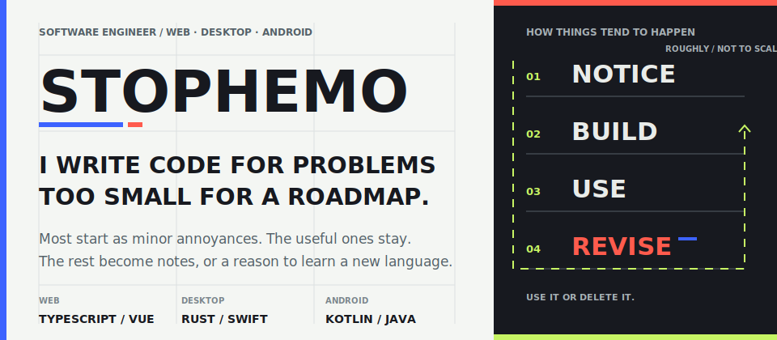

<picture>
  <source media="(max-width: 767px)" srcset="./assets/hero-v4-mobile.svg" />
  
</picture>

我喜欢把日常里那些**不值得立项，但值得写点代码**的小麻烦，变成自己愿意一直用的工具。

做东西时，我更在意数据留在哪里、断网后还能不能用，以及一个功能值不值得把系统弄复杂。能跑只是第一遍，之后通常还会再挪一个像素。

## 做完以后还在用的东西

- **[Digital Brain](https://github.com/stophemo/digital-brain)** — 用 Python 标准库搭建可迁移的本地 Markdown 知识库。
- **[Woo](https://github.com/stophemo/Woo)** — Tauri、Vue 与 Rust 写的 Markdown 笔记；数据落在本地 SQLite，断网也照常写。
- **[Woo Todo](https://github.com/stophemo/woo-todo)** — Swift + Kotlin 双端原生待办；macOS 与 Android，本地优先，同步可选。

## 手边的工具

`Web` TypeScript · Vue &nbsp;&nbsp; `Desktop` Rust · Swift &nbsp;&nbsp; `Android` Kotlin · Java &nbsp;&nbsp; `Scripts` Python

[其余仓库 →](https://github.com/stophemo?tab=repositories)
